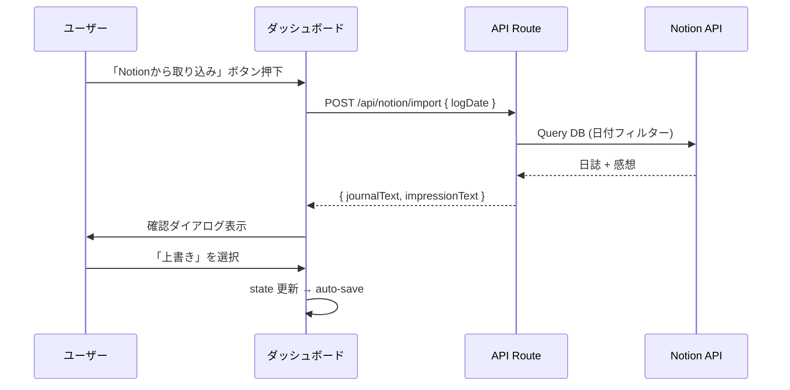

# Notion 日誌取り込み連携

## 概要

ダッシュボードの日誌・感想入力エリアに「Notionから取り込み」ボタンを設置し、選択中の日付で Notion DB をクエリして `journal_text`（日誌）と `one_line_comment`（感想）を取得・反映する。

## データマッピング

- Notion「日誌」(rich_text) → GOL `journal_text`（API ではプロパティ名 `日誌` で参照。フォールバックで id `nf%3Dt` / `nf=t`）
- Notion「感想」(rich_text) → GOL `one_line_comment`（プロパティ名 `感想` で参照。フォールバックで id `qKRW`）
- Notion DB ID: `22feac3f-dfa4-478c-aca2-d75c1d5e35c5`（ハイフンなしでも可。route 内で正規化）
- フィルター: Notion の「日付」プロパティ（または `NOTION_DATE_PROPERTY_NAME` で指定した名前）= ダッシュボードで選択中の `log_date`

## 実装内容

### 1. 環境変数の追加

- `[.env.example](gol-web/.env.example)` に `NOTION_API_KEY`、`NOTION_JOURNAL_DB_ID` を追加。任意で `NOTION_DATE_PROPERTY_NAME`（日付プロパティ名。未設定時は「日付」「Date」を試す）
- `.env.local` に実際の値を設定。API Route では **.env.local を直接読み、`process.env` と異なる場合はファイルの値を優先**する（シェル環境変数で上書きされないようにするため）

### 2. API Route 新規作成

- **ファイル**: `gol-web/app/api/notion/import/route.ts`（新規）
- **メソッド**: `POST`
- **リクエスト**: `{ logDate: "YYYY-MM-DD" }`
- **処理**:
  1. Supabase Auth でユーザー認証を確認
  2. **Notion レガシー API** を `fetch` で直接呼び出し（`Notion-Version: 2022-06-28`）。`@notionhq/client` の dataSources は既存 DB で 404 になる場合があるため未使用
  3. `GET /v1/databases/{id}` で DB アクセス可否を確認後、`POST /v1/databases/{id}/query` で日付プロパティをフィルターして該当ページを取得
  4. 取得したページの properties からプロパティ名「日誌」「感想」でテキストを取得して返却
- **レスポンス**: `{ journalText: string, impressionText: string, notionPageId: string }` or `{ error: string }`
- **補足**: `package.json` に `@notionhq/client` はあるが、本 API Route では import せず fetch のみ使用

### 3. UI: 取り込みボタンの設置

- **ファイル**: `[gol-web/app/dashboard/journal-impression-sections.tsx](gol-web/app/dashboard/journal-impression-sections.tsx)`
- 日誌セクションのヘッダー行（日誌の見出し＋開閉ボタンの横）に「Notionから取り込み」ボタンを配置
- `lucide-react` の `Import` アイコンを使用。variant は `secondary`、グレー背景（`bg-zinc-600` 等）
- 編集不可（`!isEditable`）またはローディング中（`notionImportLoading`）のときは disabled

### 4. UI: 確認ダイアログ

- 取り込みボタン押下 → API 呼び出し → 取得成功時は**常に**確認ダイアログを表示
- ダイアログで「Notion の内容で上書きしますか？」と Notion 側の日誌・感想のプレビューを表示。既存テキストの有無にかかわらず同じフロー
- ユーザーが「上書きする」を選択すると `journalText` と `impressionText` のステートを更新（既存の debounced auto-save で自動保存される）

### 5. エラーハンドリング

- Notion に該当日付のレコードがない場合: toast で「該当日の日誌が見つかりません」
- API エラー: toast でエラーメッセージ表示
- ローディング中はボタンにスピナー表示

## ファイル変更一覧

- `gol-web/.env.example` … `NOTION_API_KEY`、`NOTION_JOURNAL_DB_ID` を追加。任意で `NOTION_DATE_PROPERTY_NAME` の例をコメントで記載
- `gol-web/app/api/notion/import/route.ts` … 新規作成（fetch で Notion レガシー API 呼び出し、`.env.local` 優先の API Key 解決）
- `gol-web/app/dashboard/journal-impression-sections.tsx` … 日誌ヘッダー行にボタン追加 + 取り込みロジック・確認ダイアログ
- `gol-web/package.json` … `@notionhq/client` を追加（本機能の API Route では fetch のみ使用）

## 技術構成

